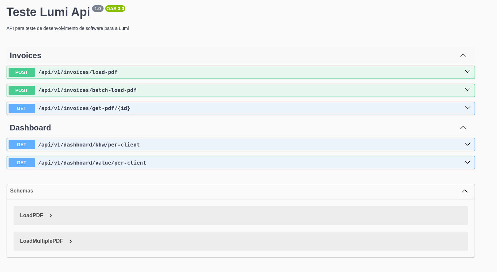

# Teste Lumi

## Author

Sou Renan, tenho 31 anos e amo desenvolver. Tenho bastante experiência com desenvolvimento de software em várias áreas de atuação. Meu hobby favorito é passar tempo com minha esposa (estamos esperando um filho chamado Isaac).

Amo aprender e compartilhar; faz parte da minha vida.

Apesar de ser fullstack, me dou muito melhor trabalhando com backend. Porém, tenho experiência em desenvolvimento web e mobile também.

Uma das minhas maiores vitórias foi ter que aprender e fazer um site para ranqueamento no Google. Tive que estudar bastante as regras de SEO e colocá-las em prática em uma startup de mobilidade urbana. Nós disponibilizávamos nossos horários para usuários que pesquisassem no Google "horário de ônibus Ana Rita" e tivemos muito sucesso por um tempo.

No desenvolvimento desse projeto, tentei dar o meu melhor. Tive que aprender a trabalhar com o plugin `pdf-parse`, que é bastante versátil para leitura de PDF em geral.


## Introduction

Para o desenvolvimento backend foi utilizado um framework express chamado NestJS na versao `10.3.2`.
A versao do node e versao `18.18.2` que e uma versao estavel.

### Server

#### Start project

Para iniciar o projeto voce anteriormente deve configuar as variaveis de ambiente, para auxiliar eu deixei um arquivo padrao chamado `.env-example` onde nele podera ver as variaveis requisitadas para o sistemas funcionar.

Para copiar basta executar (na pasta server):

```sh
 cp .env-example .env
```

Isso ira gerar um arquivo .env na raiz do projeto onde sera necessario alterar os valores das variaveis para adequar ao ambiente onde voce esta rodando.

##### Run dev mode

Para rodar o projeto em modo de desenvolvimento (apos ter criado arquivo .env na raiz server) voce podera rodar o projeto.
Basta voce executar o comando dentro da pasta `server`

```sh
 npm run start:dev
```

Garanta que voce tenha instalado o nodejs na versao do projeto, caso utilize `nvm` basta executar:

```sh
 nvm use
```

dentro da pasta `server` para pegar a versao ideal para o projeto.

Apos esses passos voce podera acessar via navegador `http://localhost:8080/api/swagger` no exemplo eu coloquei como porta `8080` porem sera necessario ajustar para sua variavel.



### Front

Para o desenvolvimento do frontend eu utilizei um template free. [Horizon UI](https://github.com/horizon-ui/horizon-ui-chakra)

#### Start project

Para iniciar o projeto do basta rodar o comando na pasta `front`

```sh
 npm run start
```

## Database

Para facilitar, estarei disponibilizando um arquivo para iniciar um Docker com a imagem mais recente do Postgres. Para executar, basta executar o comando docker-compose up -d dentro da pasta raiz desse projeto.

Os valores padrões de conexão estão nesse arquivo caso precise alterar por algum motivo.
